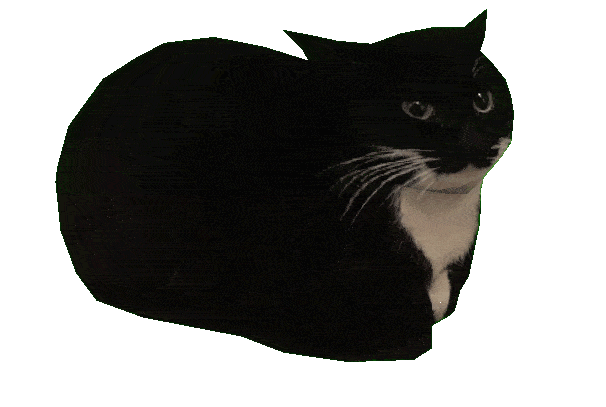

# Welcome to My Corner of the Internet

After years of meaning to start documenting my work, I'm finally pulling the trigger on this blog. If you're reading this, welcome! I'm David, an Offensive Security Engineer who spends most days breaking into things (legally, I promise) and occasionally building tools to make that process easier.

## What You'll Find Here

This blog will be a mix of:

- **CTF Writeups** - Hack The Box, TryHackMe, and other challenges
- **Tool Development** - Custom security tools and automation scripts
- **Security Research** - Vulnerability analysis and exploit development
- **Technical Notes** - Things I learn and want to remember later
- **Miscellaneous** - Random one-off projects or things that don't quite fit in the above categories

Basically, if I spend more than a few hours figuring something out, it's probably worth writing down.

## Why Another Security Blog?

Good question. The internet doesn't exactly lack security blogs, but I've always found that writing things down helps me understand them better. Plus, I hope that others can learn from my mistakes and find useful information.

Think of this as my public notebook - less polished than a formal writeup, more useful than my scattered notes in Obsidian.

## Quick Example of What to Expect

Here's how I'll typically structure posts with code examples and technical details:

### Code Blocks

```python
def simple_example():
    """Just showing off syntax highlighting"""
    vulnerabilities = ["SQLi", "XSS", "CSRF"]
    for vuln in vulnerabilities:
        print(f"Testing for {vuln}...")
    return "All checks complete"
```

### Command Examples

```bash
# Basic enumeration commands
nmap -sV -sC target.local
gobuster dir -u http://target.local -w wordlist.txt
```

### Lists and Organization

**Key Findings:**
- Port 22: SSH (OpenSSH 8.2)
- Port 80: HTTP (Apache 2.4.41)
- Port 443: HTTPS with valid cert

**Steps to Reproduce:**
1. Navigate to `/admin` endpoint
2. Intercept request with Burp Suite
3. Modify the `role` parameter
4. Profit

### Images and Screenshots

When relevant, I'll include screenshots and diagrams.



> Pro tip: Always document and take screenshots during engagements. You'll thank yourself later when writing the report.

## What's Next?

I've got a backlog of things to write up, some tool development posts in the works, maybe some HTB machines, and notes from recent exercises. Expect a mix of technical depth and practical takeaways.

If you're interested in offensive security, automation, or just breaking things in creative ways, stick around. I'll try to keep things interesting and actually useful.

**Stay tuned for more posts soon.** In the meantime, feel free to check out my [projects](/projects.html) or connect with me on [GitHub](https://github.com/Tut-k0).

---

*P.S. - If you are still reading this and are a real human, I appreciate you taking the time to visit and read my blog.*